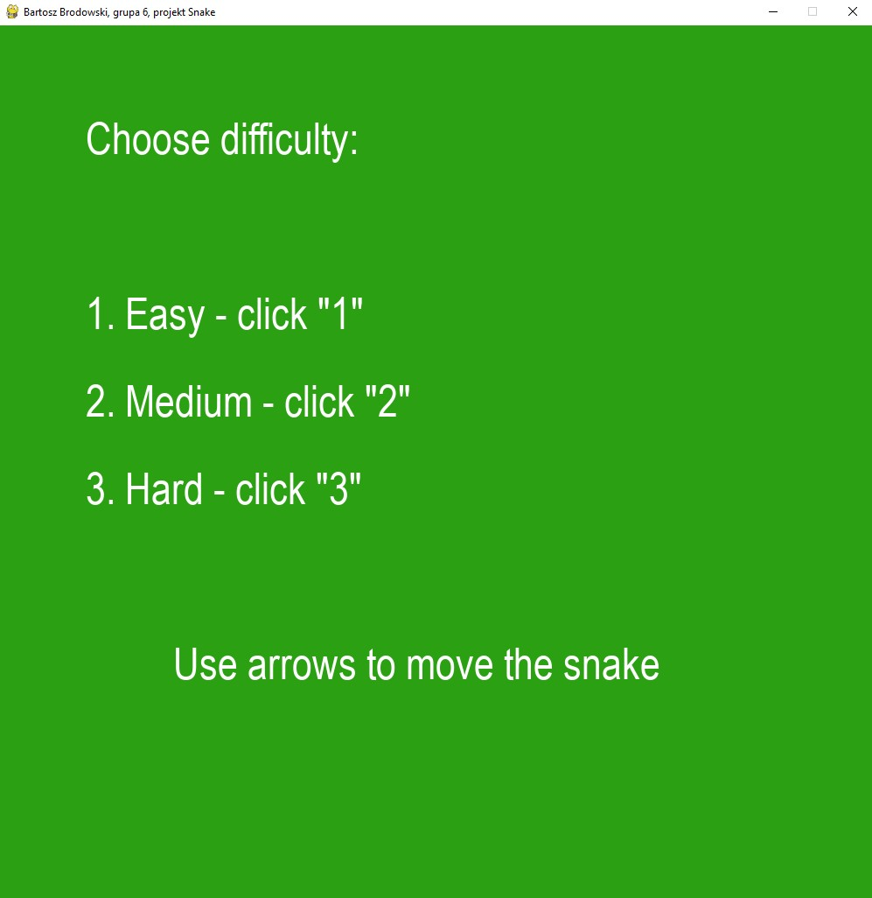
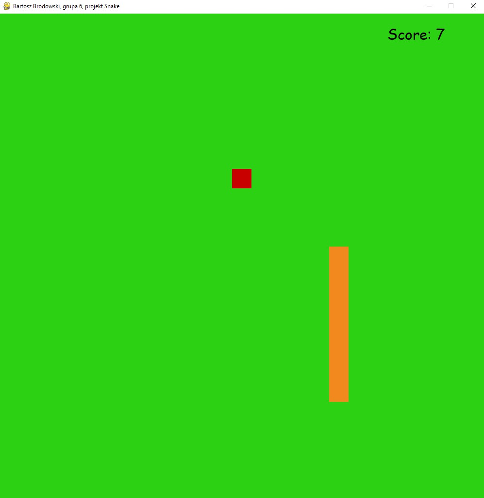
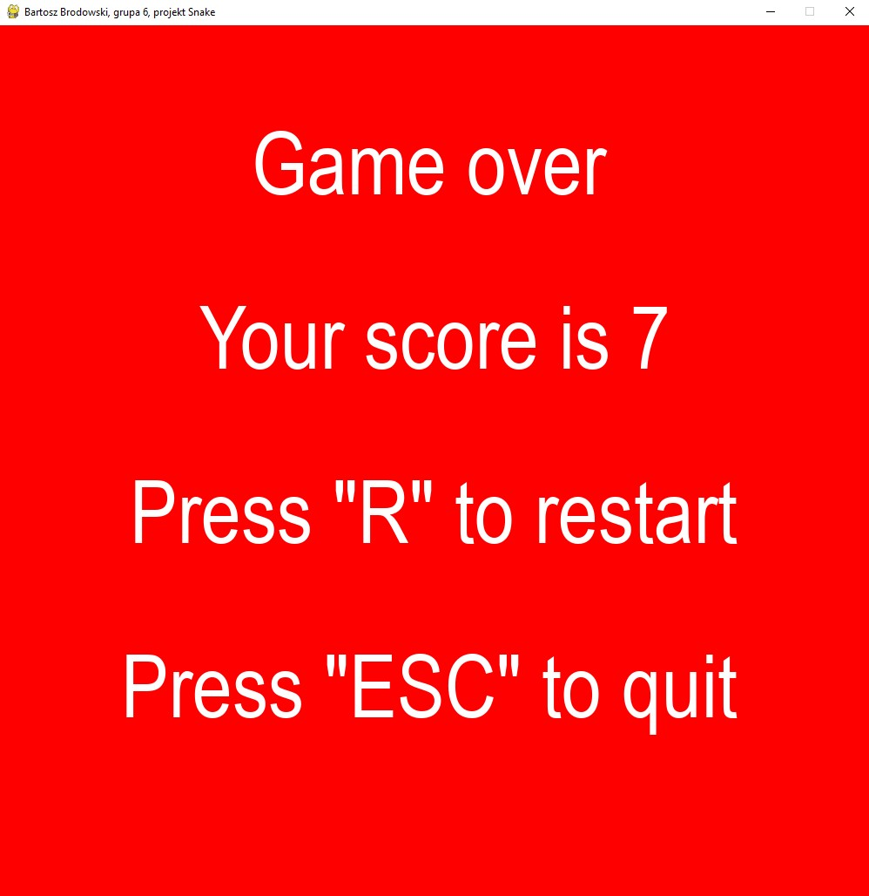

# **Snake Game** :snake:

Retro Snake game created in Python using PyGame library.
All of the "graphics" were made in pygame for the sake of convenience.
Comments made in Polish due to the fact that it's a university project.

## **Aim** 

Make a game in Python to gain points to pass a semester =)

## **How does it work?**

I've used PyGame library in order to create the game. You use arrows to steer the snake. 
When the snake collides with the red square, you gain a point and the snake elongates.
I've implemented some basic algorithms working on lists of lists to change the snakes length as well
as movement.

## Final effect

