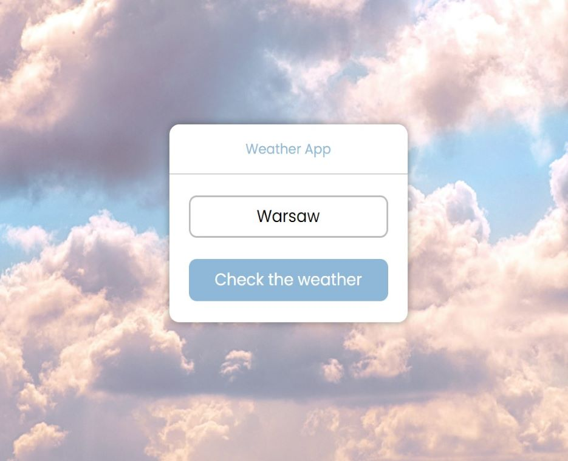
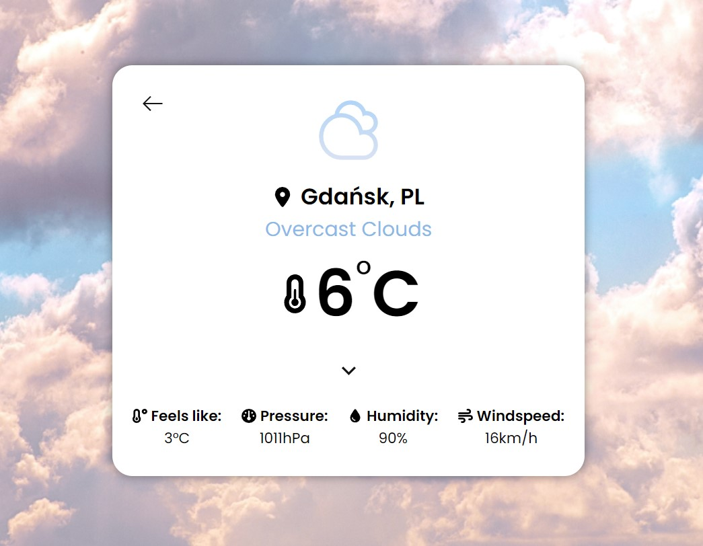
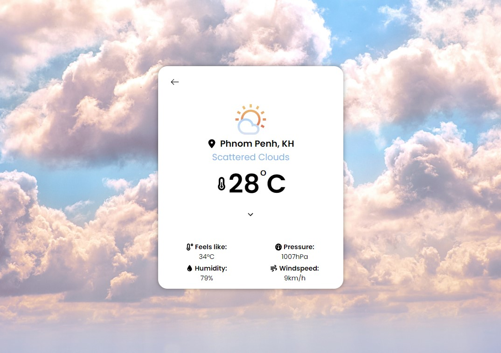

# **Weather App** :sun_behind_rain_cloud:

A project of Weather web page.

## **Aim**

Learn how to use API and train making a responsive web page (RWD).

## **How does it work?**

You simply write the city's name and click the buttom/press enter. Name of the city is sent to [OpenWeatherMapAPI](https://openweathermap.org/api). Then the web server sends back an object containing information about the weather in that particular city. Information taken from the object is displayed on the screen. The weather icons are dependent on the weather in a given place.

## **Final effect**

I've learned how to use API to fetch data for the purpose of showing information on the page.
I also trained RWD practises making this page. It should be responsive on any device.

